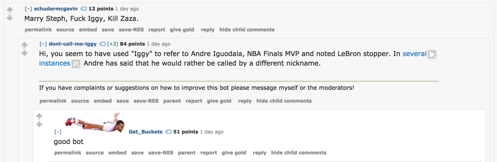

# /u/dont-call-me-iggy

[/u/dont-call-me-iggy](https://www.reddit.com/u/dont-call-me-iggy) is a Reddit bot that reminds users that Andre Iguodala doesn't like to go by "Iggy".

Built using Praw and hosted on a DigitalOcean droplet running `forever`.

Changelog:

6/12/18:

* Updated copy to reflect Andre winning his third championship.

5/29/18:

* Now also ignores the Daily Discussion Thread.

* Removed the condition for a chain of comments, since we only post once per thread anyway.

* When the bot doesn't post a comment because it has posted too recently, add that thread_id to the list of already-posted thread_ids, so that if there's a new "Iggy" comment on that thread the bot doesn't respond to it (because it is confusing that it responded to the 'newer' "Iggy" and not the 'old' one).

5/22/18:

* I keep track of the last 100 thread_ids posted to, and don't post to that thread again. When I hit 100 thread_ids, I remove the oldest one.

* I only post at most once every 3 hours.

5/9/18:

* Now ignores Game Threads and Post Game Threads (more precisely, threads with "Game Thread" in their title)

5/1/18:

* Now ignores comments whose _parent_ is /u/dont-call-me-iggy, not whose grandparent is (as was the intention)

4/30/18:

* Now ignores users who mention "bot" anywhere in the text, not just directly after "iggy"
* Ignores comments whose grandparent author is /u/dont-call-me-iggy

4/29/18:

* Fixed spelling of "Iguodala"

...

Exact date unknown, but the following improvements were added sometime after v0:

* Ignored users typing "bot"
* Ignored users typing "iggy azalea"
* Ignored users typing "iggy" in quotes
* Allowed for randomized copy via templates
